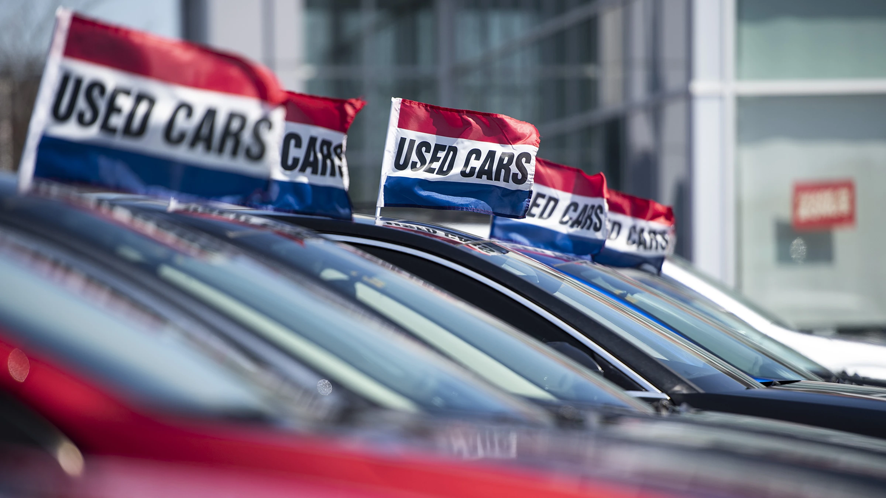

# Dubizzle Used Car Sale Price Prediction 🚗 💵

    

*A used car, a pre-owned vehicle, or a secondhand car, is a vehicle that has previously had one or more retail owners [^1]. Dubizzle is an online e-commerce company for people in the Middle East. It provides a platform (website and app ) for people to upload items ads offering users the ability to buy, sell and find things within their community [^2].* It's the dominotor of the pre-owned car market in UAE. The purpose of the project is create a machine learning model that can predict the price of a used car by using the features such as mileage, age, make, etc. that is available for the car. The predictive model will be trained using the data that was collected from Dubizzle. 

Data Overview & Preparation Steps: A brief overview of the data used, how you collected the data, and how you prepared it, which includes data preprocessing and feature engineering. Also, it is also important to provide a summary of the data.

Methodology Overview: You should also mention the techniques and tools used to achieve the project goals.

Results & Outcomes: Finally, you should also mention the results and the project outcomes and what they mean.

Growth & Next Steps: You should also mention what are the next steps and what you would do if you had more time.

## References

[^1]: [Used car](https://en.wikipedia.org/wiki/Used_car)

[^2]: [Dubizzle](https://everipedia.org/wiki/lang_en/dubizzle)
